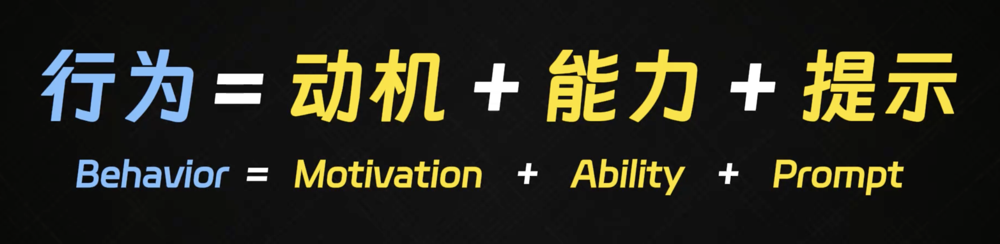
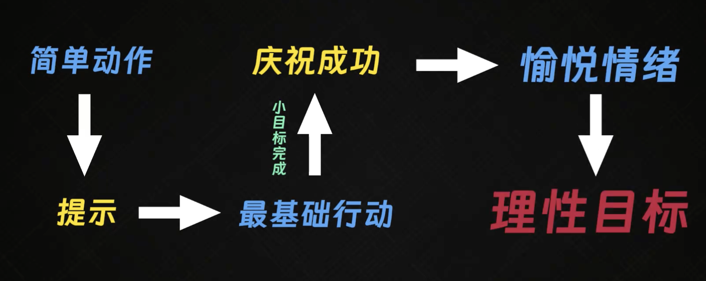

- #书籍
- 主要内容
	- 福格行为模型：行为=动机+能力+提示
		- 动机
			- 动机时强时弱，飘忽不定
		- 能力
			- 降低做事情的难度（能力门槛），循序渐进
		- 提示
			- 设定特定的提示进行提醒
		- ex. 情绪
			- 事情完成后，通过特定方式调动积极情绪
- 图片
	- 
	- 
- 相关视频
	- {{video https://www.bilibili.com/video/BV1uTfUYzEzF/?spm_id_from=333.337.search-card.all.click&vd_source=5b4c141029b3d309804a79b56a218572}}