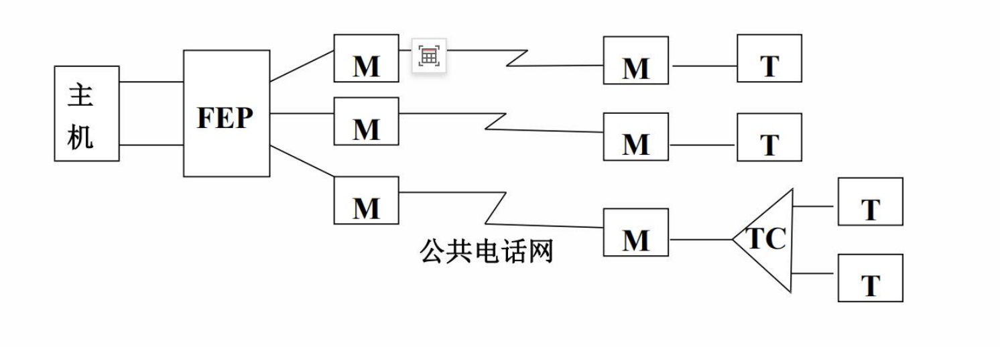
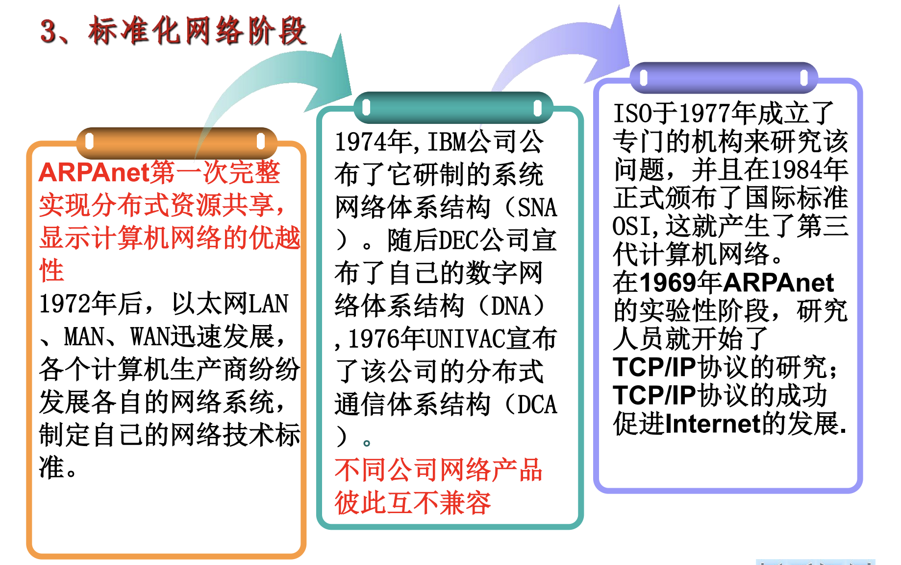

-
- 三大类网络
	- 电信网络
	- 有线电视网络
	- 计算机网络
- 四个阶段
	- 远程联机阶段
		- 
	- 多机互联网络阶段
		- ARPA网络
			- 
			- 特点
				- 资源共享
				- 分散控制
				- 分组交换
				- 采用专门的通信控制处理机 - 路由器
				- 分层的网络协议
	- 标准化网络阶段
		- 
	- 互联与高速网络阶段
		- 特征
			- 网络高速化
				- 网络宽频带
				- 传输低时延
			- 网络业务综合化
	- 计算机网络的定义
		- 必须有两台及以上、具有独立功能的计算机系统相互连接起来，以达到共享资源的目的
		- 计算机互相通信交换信息，必须有一同物理通道，该通道由物理介质实现
		- 计算机系统之间的信息交换，必须要遵守某种约定和规则
	- 计算机网络的主要功能
		- 资源共享
		- 网络通信
		- 分布处理
		- 集中管理
		- 均衡负荷
	- 计算机网络的结构组成
	- 路由器的两大功能
		- 分组交换
		- 路由选择
- 第一台电子计算机
	- ENIAC
		- 1946年诞生
		- https://zhuanlan.zhihu.com/p/145039692
	-