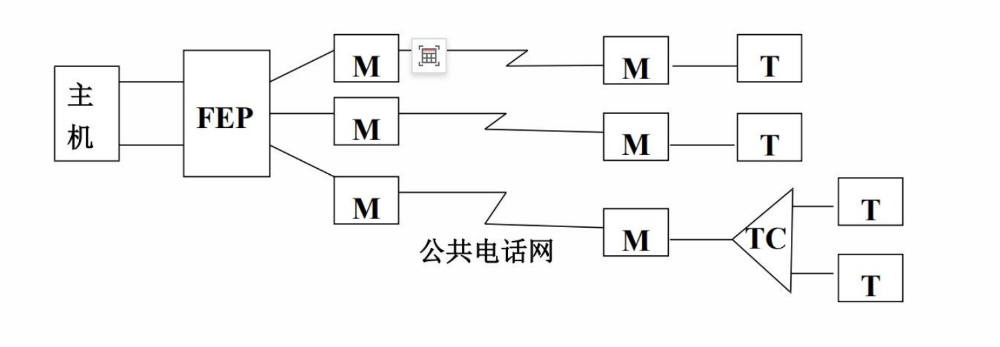
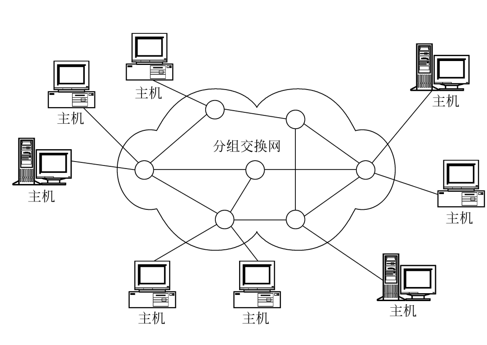
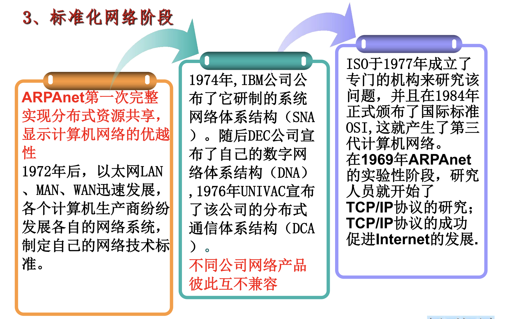

tags:: #大学课程, #计算机网络

- 三大类网络
	- 电信网络
	- 有线电视网络
	- 计算机网络
- 第一台电子计算机
	- ENIAC
		- 1946年诞生
		- https://zhuanlan.zhihu.com/p/145039692
- 四个阶段
	- 远程联机阶段
		- 
	- 多机互联网络阶段
		- ARPA网络
			- 
			- 特点
				- 资源共享
				- 分散控制
				- 分组交换
				- 采用专门的通信控制处理机 - 路由器
				- 分层的网络协议
	- 标准化网络阶段
		- 
	- 互联与高速网络阶段
		- 特征
			- 网络高速化
				- 网络宽频带
				- 传输低时延
			- 网络业务综合化
- 计算机网络的定义
	- 必须有两台及以上、具有独立功能的计算机系统相互连接起来，以达到共享资源的目的
	- 计算机互相通信交换信息，必须有一同物理通道，该通道由物理介质实现
	- 计算机系统之间的信息交换，必须要遵守某种约定和规则
- 计算机网络的主要功能
	- 资源共享
	- 网络通信
	- 分布处理
	- 集中管理
	- 均衡负荷
- 计算机网络的结构组成
	- 计算机
	- 通信处理机
	- 通信线路
	- 信息交换设备
- 路由器的两大功能
	- 分组交换
	- 路由选择
- 因特网的组成
	- 边缘部分
	- 核心部分
- 端系统通信方式
	- 客户端-服务器方式（C/S)
		- 客户端
		- 服务器端
	- 最短链接方式（P2P）
- 三种网络交换技术（按照通信子网的交换技术划分）
	- 电路交换技术
		- 电路交换的三个阶段
			- 建立连接
			- 通话
			- 释放连接
	- 报文交换技术
		- 特点
			- 无连接服务
			- 存储转发
			- 资源共享
		- 优点
			- 线路利用率高
		- 缺点
			- 延时时间长
	- 计算机数据传输的特点
		- 突发性
		- 复杂性
	- 分组交换技术
		- 核心思想
			- 分组
				- 将所需传输的大文件分成多个小的报文
			- 存储转发
			- 资源共享
- 按覆盖范围分类
	- (界限变得模糊)
	- 局域网
		- 通常采用总线型或环行拓扑结构
	- 接入网
	- 城域网
	- 广域网
	- 互联网
- 计算机网络的性能指标
	- 速率
	- 带宽
		- 时域（傅里叶变换为频域）
		- 频域
	- 吞吐量
	- 时延
		- 传输时延（发送时延）
		- 处理时延
		- 排队时延
		- 传播时延
	- 丢包率
	- 时延带宽积
	- (往返时间RTT)
	- 利用率
-